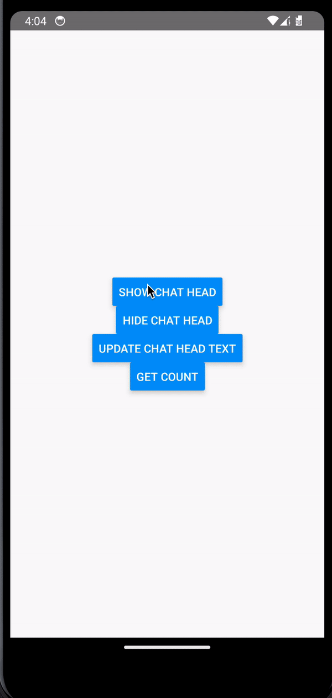

# 🚀 react-native-chat-head

android chat head (Android Only)

<p>
  
</p>

## Installation

```sh
npm install react-native-chat-head
```

1. Create `android/app/src/main/res/layout/chat_head_layout.xml` file:

```xml
<?xml version="1.0" encoding="utf-8" ?>
<RelativeLayout
  xmlns:android="http://schemas.android.com/apk/res/android"
  xmlns:tools="http://schemas.android.com/tools"
  android:layout_width="65dp"
  android:id="@+id/chat_head_root"
  android:layout_height="wrap_content"
  android:orientation="vertical"
>
    <!--Profile image for the chat head.-->
    <ImageView
    android:id="@+id/chat_head_profile_iv"
    android:layout_width="60dp"
    android:layout_height="60dp"
    android:layout_marginTop="8dp"
    android:src="@mipmap/ic_launcher"
    tools:ignore="ContentDescription"
  />
    <!--Close button-->
    <ImageView
    android:id="@+id/close_btn"
    android:layout_width="20dp"
    android:layout_height="20dp"
    android:layout_marginLeft="40dp"
    android:src="@drawable/ic_close"
    tools:ignore="ContentDescription"
  />
    <!-- chat_head_badge     -->
    <TextView
    android:id="@+id/chat_head_badge"
    android:layout_margin="5dp"
    android:layout_width="26dp"
    android:layout_height="26dp"
    android:layout_alignParentStart="true"
    android:text="1"
  />
</RelativeLayout>
```

2. Create `android/app/src/main/res/layout/dismiss_icon_layout.xml` file:

```xml
<RelativeLayout
  xmlns:android="http://schemas.android.com/apk/res/android"
  android:layout_width="wrap_content"
  android:layout_height="wrap_content"
  android:layout_gravity="bottom|center_horizontal"
>
    <!-- Dismiss icon -->
<ImageView
    xmlns:android="http://schemas.android.com/apk/res/android"
    android:id="@+id/dismiss_icon"
    android:layout_width="48dp"
    android:layout_height="48dp"
    android:layout_gravity="bottom|center_horizontal"
    android:src="@android:drawable/ic_menu_close_clear_cancel"
    android:layout_marginBottom="16dp"
  />
</RelativeLayout>
```

3. Create `android/app/src/main/res/layout/drawable-nodpi` file:

add any x image with name `ic_close.png`

## Usage

```js
import ChatHead from 'react-native-chat-head';

// ...

ChatHead.showChatHead(); // show

ChatHead.hideChatHead(); // hide

ChatHead.updateChatBadgeCount(1); // number

```

## Contributing

See the [contributing guide](CONTRIBUTING.md) to learn how to contribute to the repository and the development workflow.

## License

MIT

---

